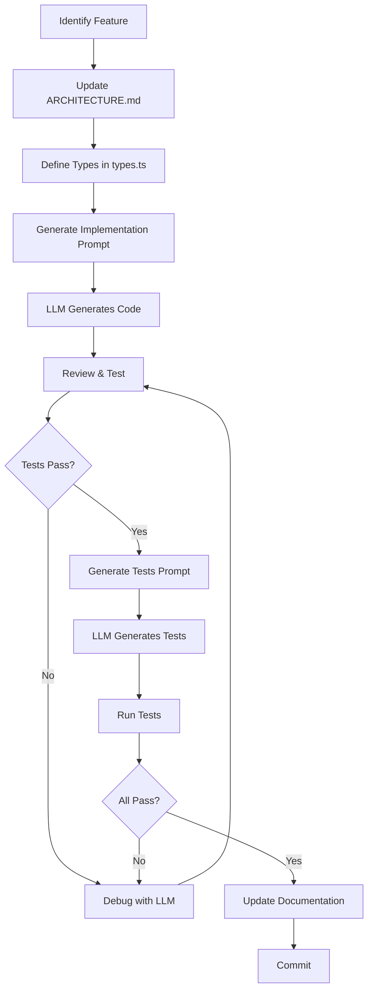
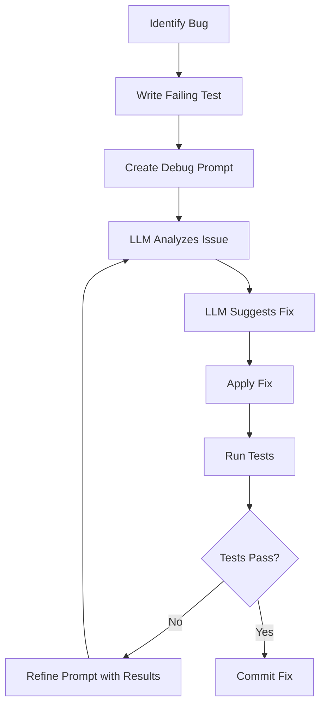
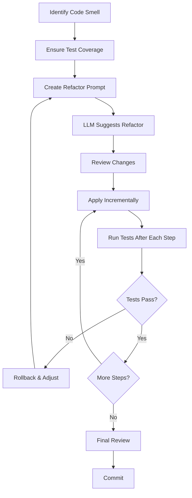

# LLM-Assisted Development Workflow

## Table of Contents
- [Overview](#overview)
- [Collaboration Principles](#collaboration-principles)
- [Prompt Patterns](#prompt-patterns)
- [Development Workflow](#development-workflow)
- [Maintaining Consistency](#maintaining-consistency)
- [When to Ask for Review](#when-to-ask-for-review)
- [Best Practices](#best-practices)

---

## Overview

This document provides guidelines for effectively collaborating with Large Language Models (LLMs) like GPT-4, Claude, or Gemini when developing this Tetris game.

### Why LLM-Assisted Development?

**Benefits:**
- **Rapid prototyping**: Generate boilerplate code quickly
- **Pattern consistency**: LLMs maintain coding patterns across modules
- **Documentation**: Auto-generate docs from code
- **Refactoring**: Safely restructure code with guidance
- **Learning**: Understand complex algorithms through explanation
- **Testing**: Generate comprehensive test cases

**Challenges:**
- **Context limits**: LLMs have limited memory
- **Hallucinations**: May generate plausible but incorrect code
- **Lack of runtime feedback**: Can't execute code to verify
- **Inconsistency**: May deviate from established patterns

---

## Collaboration Principles

### 1. Provide Clear Context

Always include:
- **What module** you're working on
- **What you want to achieve**
- **Relevant existing code** or patterns
- **Constraints** or requirements

❌ **Bad Prompt:**
```
Add rotation to the game
```

✅ **Good Prompt:**
```
I need to implement the rotate() method in src/game/Tetromino.ts.
The method should:
- Use the Super Rotation System (SRS)
- Support both clockwise and counter-clockwise rotation
- Return the new rotation state (0-3)
- Follow the pattern established in ARCHITECTURE.md

Here's the current Tetromino class structure:
[paste relevant code]
```

### 2. Incremental Development

Break large tasks into small, testable chunks:

```
Phase 1: Define Tetromino interface and types
Phase 2: Implement basic rotation (no wall kicks)
Phase 3: Add SRS wall kick logic
Phase 4: Add unit tests
Phase 5: Integrate with Board collision detection
```

### 3. Verify and Iterate

After receiving code:
1. **Review** for correctness and style
2. **Test** in your environment
3. **Provide feedback** if issues arise
4. **Iterate** until satisfactory

---

## Prompt Patterns

### Pattern 1: Feature Creation

**Template:**
```
I want to add [FEATURE] to [MODULE].

Requirements:
- [Requirement 1]
- [Requirement 2]

Context:
- Related modules: [list]
- Existing patterns: [describe]
- Type definitions: [paste from types.ts]

Please provide:
1. Updated type definitions (if needed)
2. Implementation code
3. Unit test skeleton
4. Integration points with existing code
```

**Example (future work):**
```
I want to plan the "hold piece" feature for the game.

Requirements:
- Player can press 'C' to swap current piece with a held piece
- Can only hold once per piece drop cycle
- First hold stores the current piece and spawns the next one
- Held piece would be surfaced in the UI

Context:
- Related modules: GameState, InputManager, Renderer
- Existing patterns: GameLoop → InputManager → GameStateManager (future EventBus will broadcast lifecycle hooks)
- Type definitions: [paste GameState interface]

Please provide:
1. Proposed GameState updates
2. Hold logic description
3. InputManager integration sketch
4. Renderer/UX ideas for the held piece
```

### Pattern 2: Debugging

**Template:**
```
I'm experiencing [PROBLEM] in [MODULE].

Expected behavior:
[Describe what should happen]

Actual behavior:
[Describe what's happening]

Relevant code:
[Paste code snippet]

Error message (if any):
[Paste error]

What I've tried:
- [Attempt 1]
- [Attempt 2]

Please help me identify the issue and suggest a fix.
```

### Pattern 3: Refactoring

**Template:**
```
I want to refactor [CODE/MODULE] to [GOAL].

Current implementation:
[Paste code]

Desired outcome:
- [Improvement 1]
- [Improvement 2]

Constraints:
- Must maintain existing API
- Should not break tests
- Follow [PATTERN] pattern

Please provide:
1. Refactored code
2. Migration guide (if API changes)
3. Updated tests
```

### Pattern 4: Code Review

**Template:**
```
Please review this [MODULE] implementation for:
- Correctness
- Performance
- Type safety
- Adherence to project patterns
- Edge cases

Code:
[Paste implementation]

Specific concerns:
- [Concern 1]
- [Concern 2]
```

### Pattern 5: Test Generation

**Template:**
```
Generate comprehensive unit tests for [MODULE/FUNCTION].

Code to test:
[Paste code]

Test cases should cover:
- Happy path
- Edge cases: [list specific edges]
- Error conditions
- Boundary values

Use Vitest framework and follow existing test patterns in tests/
```

### Pattern 6: Documentation

**Template:**
```
Generate JSDoc documentation for [MODULE/CLASS/FUNCTION].

Code:
[Paste code]

Include:
- Description
- Parameter types and descriptions
- Return type and description
- Usage examples
- Edge cases or gotchas
```

---

## Development Workflow

### Workflow 1: Adding a New Feature



### Workflow 2: Fixing a Bug



### Workflow 3: Refactoring



---

## Maintaining Consistency

### 1. Reference Existing Patterns

Always point the LLM to existing code:

```
"Follow the same pattern as InputManager for event handling"
"Use the same error handling approach as Board.clearLines()"
"Match the coding style in src/engine/GameLoop.ts"
```

### 2. Use Type Definitions as Contract

Update `types.ts` first, then generate implementation:

```
Step 1: "Add HeldPiece property to GameState interface"
Step 2: "Implement hold piece logic using updated GameState type"
```

### 3. Maintain a Style Guide

Create a `STYLE_GUIDE.md` and reference it:

```
"Follow the naming conventions in STYLE_GUIDE.md"
"Use the error handling pattern from STYLE_GUIDE.md"
```

### 4. Version Control Integration

Use git to track LLM-generated code:

```bash
# Create feature branch
git checkout -b feature/hold-piece

# Commit LLM-generated code with clear message
git commit -m "feat: add hold piece (LLM-generated, needs review)"

# Review and refine
git commit -m "refactor: improve hold piece validation"
```

---

## When to Ask for Review

### Always Review:

1. **Core game logic** (collision, rotation, scoring)
2. **Performance-critical code** (game loop, rendering)
3. **Complex algorithms** (SRS wall kicks, T-spin detection)
4. **Public APIs** (interfaces, exported functions)
5. **Security-sensitive code** (input validation, state management)

### Can Skip Review:

1. **Boilerplate code** (interfaces, type definitions)
2. **Simple utilities** (color conversion, math helpers)
3. **Test skeletons** (can refine later)
4. **Documentation** (easy to fix)

### Review Checklist:

- [ ] Code compiles without errors
- [ ] All tests pass
- [ ] No obvious bugs or edge cases missed
- [ ] Follows project patterns and style
- [ ] Types are correct and strict
- [ ] Performance is acceptable
- [ ] Documentation is accurate

---

## Best Practices

### 1. Chain of Thought Prompting

For complex problems, ask LLM to think step-by-step:

```
"Before implementing T-spin detection, please:
1. Explain the T-spin rules
2. Outline the detection algorithm
3. Identify edge cases
4. Then provide the implementation"
```

### 2. Few-Shot Learning

Provide examples of desired output:

```
"Generate a test file similar to tests/Board.test.ts.
Here's the pattern to follow:
[paste example test]

Now create tests for Tetromino.ts"
```

### 3. Iterative Refinement

Don't expect perfection on first try:

```
First prompt: "Generate basic rotation logic"
Review: "This doesn't handle wall kicks"
Second prompt: "Add SRS wall kick tests to the rotation logic"
Review: "I-piece kicks are wrong"
Third prompt: "Fix I-piece wall kick table according to SRS spec"
```

### 4. Constraint Specification

Be explicit about limitations:

```
"Implement collision detection.
Constraints:
- Must run in O(n) time where n = piece cells
- No external dependencies
- Must work with existing Board interface
- Cannot modify Board class"
```

### 5. Test-Driven Prompting

Generate tests first:

```
"Generate unit tests for a Tetromino rotation method that:
- Rotates clockwise and counter-clockwise
- Handles all 7 piece types
- Returns new rotation state (0-3)
- Doesn't mutate original piece"

[Review tests]

"Now implement the rotation method to pass these tests"
```

### 6. Documentation-Driven Development

Generate docs, then code:

```
"Write JSDoc for a collision detection function that:
- Takes board, piece, x, y as parameters
- Returns boolean (true if collision)
- Checks bounds and cell occupation"

[Review docs]

"Now implement the function matching this documentation"
```

### 7. Modular Prompts

Break complex features into modules:

```
Session 1: "Create types for scoring system"
Session 2: "Implement base score calculation"
Session 3: "Add combo and back-to-back bonuses"
Session 4: "Integrate with GameState"
Session 5: "Add tests"
```

---

## Common Pitfalls

### ❌ Pitfall 1: Vague Prompts

**Problem:**
```
"Make the game better"
```

**Solution:**
```
"Optimize the rendering loop to maintain 60 FPS by:
- Using requestAnimationFrame
- Implementing dirty rectangle rendering
- Caching static elements"
```

### ❌ Pitfall 2: Too Much at Once

**Problem:**
```
"Implement the entire game logic in one go"
```

**Solution:**
```
"Implement just the Board class with:
- Grid initialization
- Cell get/set methods
- Bounds checking
Then we'll add line clearing in the next step"
```

### ❌ Pitfall 3: No Context

**Problem:**
```
"Fix this bug: [paste error]"
```

**Solution:**
```
"I'm getting this error in Board.lockPiece():
[paste error]

Here's the method:
[paste code]

Here's how it's called:
[paste caller]

Expected: Piece should lock at position
Actual: Error thrown"
```

### ❌ Pitfall 4: Ignoring Types

**Problem:**
```
"Add a score property to the game"
```

**Solution:**
```
"Add a score property to GameState interface in types.ts:
- Type: number
- Initial value: 0
- Should be immutable (readonly)

Then update GameStateManager to handle score updates"
```

---

## Advanced Techniques

### Zero-Shot Prompting

For well-defined tasks:

```
"Implement a shuffle function for the 7-bag randomizer using Fisher-Yates algorithm"
```

### Few-Shot Prompting

For pattern matching:

```
"Here are two existing game classes:

[paste Board.ts]
[paste Tetromino.ts]

Following the same pattern, create a ScoreManager class that:
- Manages score state
- Calculates points for line clears
- Emits events on score changes"
```

### Chain-of-Thought

For complex logic:

```
"I need to implement T-spin detection. Let's think through this:

1. What are the conditions for a T-spin?
2. How do we detect if a T-piece is in a T-slot?
3. What data do we need to track?
4. What edge cases exist?

After analyzing these, provide the implementation"
```

### Self-Consistency

Ask multiple times and compare:

```
Session 1: "Implement SRS wall kick tests for I-piece"
Session 2: "Implement SRS wall kick tests for I-piece" (new conversation)

[Compare outputs, choose best or merge]
```

---

## Conclusion

LLM-assisted development is most effective when you:
- **Provide clear context** and requirements
- **Work incrementally** with small, testable chunks
- **Review and verify** all generated code
- **Maintain consistency** through patterns and types
- **Iterate and refine** based on results

Remember: **LLMs are tools, not replacements for developers.** Use them to accelerate development, but always apply critical thinking and testing.
